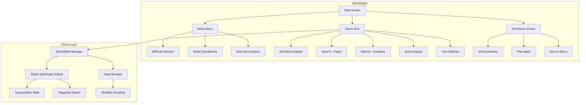

# Triplecargo Desktop Game - MVP Architecture Plan

## Overview

Build a playable Triple Triad desktop game using `eframe/egui` with the existing triplecargo solver engine. The game will feature difficulty levels, configurable rules, and a clean 2D interface showing cards with their stats.

## Technology Stack

- **GUI Framework**: `eframe` + `egui` 0.28+ (pure Rust, immediate mode)
- **Backend**: Existing triplecargo library (`src/`)
- **Build**: `cargo build --release` produces a single executable

## System Architecture



## Component Details

### 1. Game Setup Menu

**UI Elements:**
- Title: "Triplecargo - Triple Triad"
- Difficulty selector (Radio buttons or dropdown):
  - **Easy**: Search depth 1-2 (greedy/short lookahead)
  - **Medium**: Search depth 4-5 (moderate lookahead)
  - **Hard**: Search depth 9 (full perfect play)
- Rules configuration (checkboxes):
  - [ ] Elemental (element bonuses/penalties)
  - [ ] Same (adjacent equal = flip)
  - [ ] Plus (adjacent sum pairs = flip)
  - [ ] Same Wall (wall edges count for Same rule)
- "New Game" button

**State:**
```rust
struct GameSetup {
    difficulty: Difficulty,
    rules: Rules,
    seed: u64,  // for reproducible hands
}
```

### 2. Game Grid Layout

```
┌─────────────────────────────────────────────┐
│  Difficulty: Hard | Rules: Elemental, Same  │
├─────────────────────────────────────────────┤
│  Turn: Your Move (A)                        │
│  Score: A:3  B:2                            │
│                                             │
│      ┌───┬───┬───┐                         │
│      │ 0 │ 1 │ 2 │   ← Cell labels (0-8)    │
│      ├───┼───┼───┤                         │
│      │ 3 │ 4 │ 5 │                         │
│      ├───┼───┼───┤                         │
│      │ 6 │ 7 │ 8 │                         │
│      └───┴───┴───┘                         │
│                                             │
│  Your Hand (A):                             │
│  ┌─────┐ ┌─────┐ ┌─────┐ ┌─────┐ ┌─────┐  │
│  │  7  │ │ 12  │ │  5  │ │  3  │ │  9  │  │
│  │ 5↑  │ │ 7→  │ │ 4↓  │ │ 6←  │ │ 8↑  │  │  ← Stats
│  │ 5↓  │ │ 7←  │ │ 4↑  │ │ 6→  │ │ 8↓  │  │
│  └─────┘ └─────┘ └─────┘ └─────┘ └─────┘  │
│   [F]    [I]                       Fire   │
│           Ice                      elem   │
│                                             │
│  Computer's Hand (B):  (hidden/revealed)    │
│  ┌─────┐ ┌─────┐ ┌─────┐ ┌─────┐ ┌─────┐  │
│  │  ?  │ │  ?  │ │  ?  │ │  ?  │ │  ?  │  │
│  │ ?↑? │ │ ?→? │ │ ?↓? │ │ ?←? │ │ ?↑? │  │
│  └─────┘ └─────┘ └─────┘ └─────┘ └─────┘  │
│                                             │
│  [Computer is thinking... ]                 │
│                                             │
│  [New Game]  [Give Up]                      │
└─────────────────────────────────────────────┘
```

### 3. Card Display

Each card shown as:
- Card name (e.g., "Cactuar", "Chocobo")
- Level indicator (stars or number)
- Four stats: top, right, bottom, left (displayed around a center square)
- Element badge (if elemental rule enabled)

```rust
struct UiCard {
    card_id: u16,
    is_computer: bool,  // hide stats if true
}
```

### 4. Interaction Flow

**Player Turn:**
1. Click on a card in hand to select it (highlight)
2. Click on an empty cell to play
3. Validate move (card in hand, cell empty)
4. Apply move, update board, switch turn

**Computer Turn:**
1. Disable input
2. Call solver with configured depth
3. Display "thinking" indicator
4. Apply best move after brief delay (for UX)
5. Switch turn back to player

### 5. Difficulty Implementation

| Level | Search Depth | Behavior |
|-------|--------------|----------|
| Easy | 1 | Only immediate capture value (greedy) |
| Medium | 4 | Look ahead 4 plies (~50% of game tree) |
| Hard | 9 | Full perfect-play search |

**Implementation:**
```rust
struct ComputerOpponent {
    difficulty: Difficulty,
    solver: Solver,
}

impl ComputerOpponent {
    fn choose_move(&mut self, state: &GameState, cards: &CardsDb) -> Move {
        let depth = match self.difficulty {
            Difficulty::Easy => 1,
            Difficulty::Medium => 4,
            Difficulty::Hard => 9,
        };
        self.solver.limits.max_depth = depth;
        self.solver.search(state, cards).best_move
    }
}
```

### 6. Hand Sampling (Stratified)

Reuse existing logic from `src/bin/precompute.rs`:

```rust
fn sample_stratified_hands(cards: &CardsDb, rng: &mut u64) -> ([u16; 5], [u16; 5]) {
    // Cards grouped by level: [1-2], [3-4], [5-6], [7-8], [9-10]
    // Pick one random card from each band for each player
}
```

### 7. Game State Management

```rust
enum AppState {
    Setup,
    Playing,
    GameOver { result: GameResult },
}

enum GameResult {
    Win,
    Loss,
    Draw,
}

struct TriplecargoApp {
    state: AppState,
    game_state: GameState,
    cards: CardsDb,
    selected_card: Option<u16>,
    difficulty: Difficulty,
    computer: ComputerOpponent,
    history: Vec<GameState>,  // for undo (optional)
}
```

### 8. Score Display

```rust
fn display_score(state: &GameState) -> (i8, i8) {
    let score = score(state);  // A - B
    let a_score = (score + 9) / 2;  // Convert diff to A's count
    let b_score = 9 - a_score;
    (a_score, b_score)
}
```

## File Structure

```
src/
├── bin/
│   └── tt-gui.rs        # NEW: Main eframe application
├── lib.rs               # Add re-exports if needed
├── gui/                 # NEW: GUI module
│   ├── mod.rs
│   ├── board.rs         # Board rendering
│   ├── card.rs          # Card widget
│   ├── menu.rs          # Setup menu
│   └── game.rs          # Game screen
└── ...
```

## Implementation Steps

1. **Add eframe dependency** to `Cargo.toml`
2. **Create `src/bin/tt-gui.rs`** with basic eframe boilerplate
3. **Implement `gui/menu.rs`** - setup screen with difficulty/rules
4. **Implement `gui/board.rs`** - 3x3 grid with cell selection
5. **Implement `gui/card.rs`** - card display widget
6. **Implement `gui/game.rs`** - main game loop and state
7. **Integrate solver** - call `Solver::search()` on computer turn
8. **Add hand sampling** - stratified sampling for fair hands
9. **Handle end game** - detect terminal, show result
10. **Polish UI** - colors, spacing, feedback

## Dependencies to Add

```toml
eframe = "0.28"  # or latest
egui = "0.28"
```

## Testing Strategy

- Manual gameplay testing at each difficulty level
- Verify solver returns valid moves
- Verify stratified hands provide variety
- Test all rule combinations
- Test edge cases (full board, no moves, etc.)

## Future Enhancements (Post-MVP)

- Move history with undo
- Hints/show computer evaluation
- Multiple board themes
- Sound effects
- Save/load games
- Time limits on computer moves
- "Analysis mode" to see PV lines
